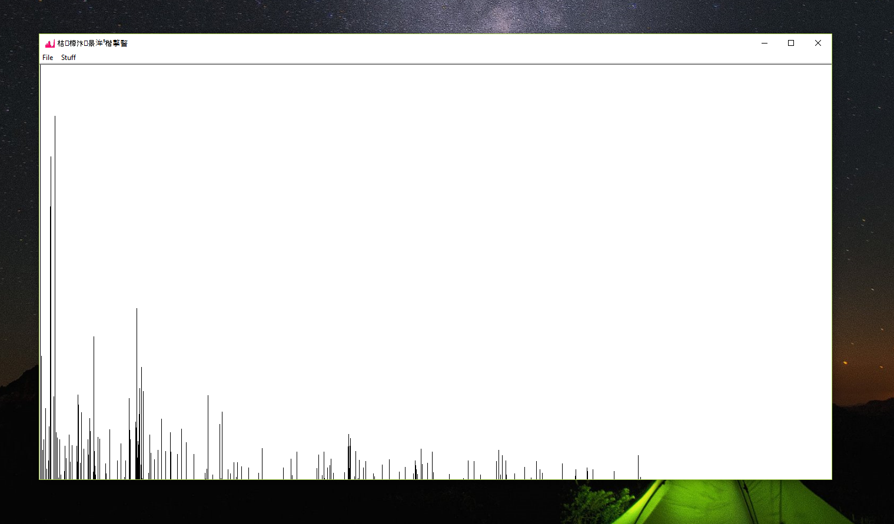

# Audio Analysis in C
## Example frequency analysis

## Process
- The GUI creation, GUI refreshing, & audio input are all done through Win32 API calls through the Windows Operating System. This means that this program will only work on Windows based systems [i.e. not Linux or Mac OsX].
- After audio has been read into a buffer, the buffer is run through a Fast Fourier Transform, which enables us to gather the most prominent frequencies in a signal.
- These signals are then rendered to the screen using API calls.
- Data is read into the audio buffer between screen updates, which have a length of 50 milliseconds.
- All software was written in C.